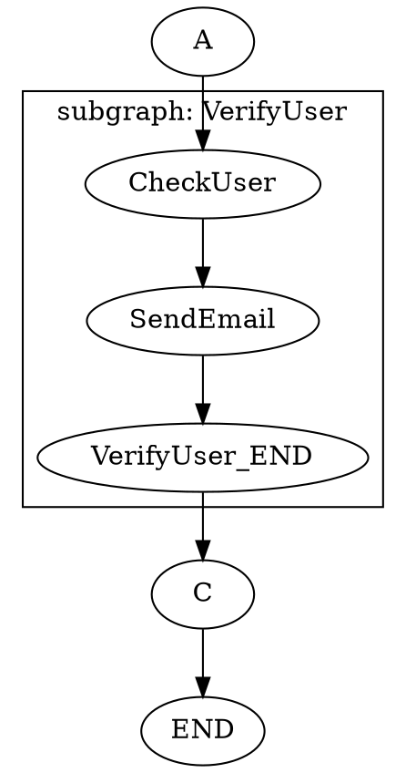

** dgraph **

[](https://goreportcard.com/report/github.com/kimbuba/dgraph)
[](https://pkg.go.dev/github.com/kimbuba/dgraph)
[](https://opensource.org/licenses/MIT)

`dgraph` is a powerful and flexible Go library for building and executing stateful, directed graph-based workflows. It enables you to model complex processes, state machines, or business logic as a series of interconnected, runnable nodes. With features like compile-time validation, dynamic routing, parallel execution, and subgraphs, it provides a robust framework for creating modular and maintainable systems.

## Key Features

*   **Compile-Time Validation:** Catches structural errors like unreachable nodes, broken links, and paths that don't terminate, preventing entire classes of runtime bugs.
*   **Flexible Node Types:**
    *   **Static Nodes:** Follow a fixed, predefined path.
    *   **Dynamic Nodes:** Choose the next path at runtime based on conditional logic.
    *   **Parallel Nodes:** Execute multiple branches of work concurrently and wait for all to complete before proceeding.
*   **Composable & Reusable:** Nest graphs within each other as **subgraphs** to build complex workflows from smaller, self-contained, and reusable units.
*   **Thread-Safe State Management:** A shared state object, protected by a mutex, is passed through the graph, allowing nodes to safely communicate and share data.
*   **Visualization:** Automatically generate graph representations in **DOT format**, which can be rendered by tools like Graphviz to visualize your workflow's structure.
*   **Loop Protection:** A configurable maximum iteration count prevents accidental infinite loops during execution.

## Installation

```sh
go get github.com/kimbuba/dgraph
```

## Core Concepts

*   **`Node`**: The fundamental unit of work. It has a `Run` method that contains your logic.
*   **`State`**: A thread-safe map (`map[any]any`) passed to every node, used to store and share data throughout the workflow.
*   **`Graph`**: A collection of nodes with a defined entry point. It's compiled from a `GraphBuilder`.
*   **`EndNode`**: A special reserved name (`"END"`) used to signify the termination of a path in the graph.

## Usage Examples

### 1. Basic Static Graph

A simple workflow where Node `A` transitions to Node `B`, which then ends. This demonstrates the fundamental build, compile, and run cycle.

```go
package main

import (
	"context"
	"fmt"
	"github.com/kimbuba/dgraph"
)

func main() {
	// 1. Create a builder for the graph.
	builder := dgraph.NewGraphBuilder("SimpleWorkflow", "A", 10)

	// 2. Define the nodes with their logic.
	// Node A simply sets a value in the shared state.
	nodeA := dgraph.NewStaticNodeImpl("A", "B", func(ctx context.Context, state *dgraph.State) error {
		fmt.Println("Executing Node A")
		state.Data["visited_A"] = true
		return nil
	})

	// Node B transitions to the end of the graph.
	nodeB := dgraph.NewStaticNodeImpl("B", dgraph.EndNode, func(ctx context.Context, state *dgraph.State) error {
		fmt.Println("Executing Node B")
		state.Data["visited_B"] = true
		return nil
	})

	// 3. Add nodes to the builder.
	builder.AddNode(nodeA)
	builder.AddNode(nodeB)

	// 4. Compile the graph. This validates the structure.
	graph, err := builder.Compile()
	if err != nil {
		panic(err)
	}

	// 5. Run the graph with an initial state.
	initialState := &dgraph.State{Data: make(map[any]any)}
	finalResult, err := graph.Run(context.Background(), initialState)
	if err != nil {
		panic(err)
	}

	fmt.Printf("Workflow finished. Final state: %+v\n", finalResult.State.Data)
}

/*
Output:
Executing Node A
Executing Node B
Workflow finished. Final state: map[visited_A:true visited_B:true]
*/
```

### 2. Dynamic (Conditional) Graph

A workflow where Node `A` dynamically decides whether to go to Node `B` or Node `C` based on data in the shared `State`.

```go
package main

import (
	"context"
	"fmt"
	"github.com/kimbuba/dgraph"
)

func main() {
	builder := dgraph.NewGraphBuilder("ConditionalWorkflow", "A", 10)

	// Define a key for our state map for type safety.
	type routeKey string
	const decisionKey routeKey = "route"

	// Node A is dynamic. It inspects the state to decide the next node.
	nodeA := dgraph.NewDynamicNodeImpl(
		"A",
		[]string{"B", "C"}, // List all possible next nodes for compile-time validation
		func(ctx context.Context, state *dgraph.State) (string, error) {
			fmt.Println("Executing Node A - Making a decision...")
			
			// Use the generic helper to safely get a value from state
			route, _ := dgraph.Get[string](state.Data, decisionKey)

			if route == "path_c" {
				return "C", nil
			}
			// Default to B
			return "B", nil
		},
	)

	nodeB := dgraph.NewStaticNodeImpl("B", dgraph.EndNode, func(ctx context.Context, state *dgraph.State) error {
		fmt.Println("Executing Node B")
		state.Data["path_taken"] = "B"
		return nil
	})

	nodeC := dgraph.NewStaticNodeImpl("C", dgraph.EndNode, func(ctx context.Context, state *dgraph.State) error {
		fmt.Println("Executing Node C")
		state.Data["path_taken"] = "C"
		return nil
	})

	builder.AddNode(nodeA)
	builder.AddNode(nodeB)
	builder.AddNode(nodeC)

	graph, err := builder.Compile()
	if err != nil {
		panic(err)
	}
	
	// Run once, taking path C
	fmt.Println("--- Running with decision 'path_c' ---")
	initialStateC := &dgraph.State{Data: map[any]any{decisionKey: "path_c"}}
	finalResultC, _ := graph.Run(context.Background(), initialStateC)
	fmt.Printf("Workflow finished. Final state: %+v\n\n", finalResultC.State.Data)
	
	// Run again, taking the default path B
	fmt.Println("--- Running with default decision ---")
	initialStateB := &dgraph.State{Data: make(map[any]any)}
	finalResultB, _ := graph.Run(context.Background(), initialStateB)
	fmt.Printf("Workflow finished. Final state: %+v\n", finalResultB.State.Data)
}

/*
Output:
--- Running with decision 'path_c' ---
Executing Node A - Making a decision...
Executing Node C
Workflow finished. Final state: map[route:path_c path_taken:C]

--- Running with default decision ---
Executing Node A - Making a decision...
Executing Node B
Workflow finished. Final state: map[path_taken:B]
*/
```

### 3. Parallel Execution

A workflow that executes two tasks in parallel and waits for both to complete before continuing to the final step.

```go
package main

import (
	"context"
	"fmt"
	"github.com/kimbuba/dgraph"
	"sync/atomic"
	"time"
)

func main() {
	builder := dgraph.NewGraphBuilder("ParallelWorkflow", "A", 10)

	builder.AddNode(dgraph.NewStaticNodeImpl("A", "ParallelTasks", func(ctx context.Context, state *dgraph.State) error {
		fmt.Println("Executing Node A")
		// Use an atomic type for safe concurrent updates
		state.Data["counter"] = &atomic.Int32{}
		return nil
	}))
	
	// Define the inner nodes for the parallel step. These don't need a name or a `next`.
	task1 := dgraph.NewInnerNodeImpl(func(ctx context.Context, state *dgraph.State) error {
		fmt.Println("Starting parallel task 1...")
		time.Sleep(100 * time.Millisecond) // Simulate work
		counter, _ := dgraph.Get[*atomic.Int32](state.Data, "counter")
		counter.Add(1)
		fmt.Println("...Finished parallel task 1")
		return nil
	})
	
	task2 := dgraph.NewInnerNodeImpl(func(ctx context.Context, state *dgraph.State) error {
		fmt.Println("Starting parallel task 2...")
		time.Sleep(150 * time.Millisecond) // Simulate work
		counter, _ := dgraph.Get[*atomic.Int32](state.Data, "counter")
		counter.Add(1)
		fmt.Println("...Finished parallel task 2")
		return nil
	})

	// Create the parallel node. It runs task1 and task2 concurrently.
	// After both finish, it transitions to node "C".
	parallelNode := dgraph.NewParallelNode("ParallelTasks", "C", task1, task2)
	builder.AddNode(parallelNode)

	builder.AddNode(dgraph.NewStaticNodeImpl("C", dgraph.EndNode, func(ctx context.Context, state *dgraph.State) error {
		fmt.Println("Executing Node C")
		counter, _ := dgraph.Get[*atomic.Int32](state.Data, "counter")
		fmt.Printf("Both parallel tasks completed. Final counter: %d\n", counter.Load())
		return nil
	}))

	graph, err := builder.Compile()
	if err != nil {
		panic(err)
	}

	initialState := &dgraph.State{Data: make(map[any]any)}
	_, err = graph.Run(context.Background(), initialState)
	if err != nil {
		panic(err)
	}
}

/* Note: Output order of parallel tasks may vary.
Output:
Executing Node A
Starting parallel task 1...
Starting parallel task 2...
...Finished parallel task 1
...Finished parallel task 2
Executing Node C
Both parallel tasks completed. Final counter: 2
*/
```

### 4. Using Subgraphs

Encapsulate a piece of a workflow into a reusable subgraph, promoting modular design.

```go
package main

import (
	"context"
	"fmt"
	"github.com/kimbuba/dgraph"
)

// createVerificationSubgraph creates a self-contained graph for user verification.
func createVerificationSubgraph() *dgraph.Graph {
	// A subgraph is just a graph built with a specific builder.
	// It has a start point ("CheckUser") and a join point ("C") which is the name
	// of the node in the PARENT graph to go to when this subgraph finishes.
	subBuilder := dgraph.NewSubGraphBuilder("VerifyUser", "CheckUser", "C")
	
	subBuilder.AddNode(dgraph.NewStaticNodeImpl("CheckUser", "SendEmail", func(ctx context.Context, state *dgraph.State) error {
		fmt.Println("  [SUB] Checking user status...")
		state.Data["sub_check"] = true
		return nil
	}))
	
	subBuilder.AddNode(dgraph.NewStaticNodeImpl("SendEmail", dgraph.EndNode, func(ctx context.Context, state *dgraph.State) error {
		fmt.Println("  [SUB] Sending verification email...")
		state.Data["sub_email"] = true
		return nil
	}))
	
	subGraph, err := subBuilder.Compile()
	if err != nil {
		panic(err)
	}
	return subGraph
}

func main() {
	mainBuilder := dgraph.NewGraphBuilder("MainWorkflow", "A", 10)
	
	mainBuilder.AddNode(dgraph.NewStaticNodeImpl("A", "VerifyUser", func(ctx context.Context, state *dgraph.State) error {
		fmt.Println("[MAIN] Starting workflow, preparing for verification.")
		state.Data["main_A"] = true
		return nil
	}))

	// Add the entire compiled subgraph as a single node.
	verificationGraph := createVerificationSubgraph()
	mainBuilder.AddNode(verificationGraph)

	// This is the "join point" node defined in the subgraph builder.
	mainBuilder.AddNode(dgraph.NewStaticNodeImpl("C", dgraph.EndNode, func(ctx context.Context, state *dgraph.State) error {
		fmt.Println("[MAIN] Subgraph finished, completing main workflow.")
		state.Data["main_C"] = true
		return nil
	}))
	
	mainGraph, err := mainBuilder.Compile()
	if err != nil {
		panic(err)
	}
	
	initialState := &dgraph.State{Data: make(map[any]any)}
	finalResult, err := mainGraph.Run(context.Background(), initialState)
	if err != nil {
		panic(err)
	}

	fmt.Printf("\nWorkflow finished. Final state: %+v\n", finalResult.State.Data)
}

/*
Output:
[MAIN] Starting workflow, preparing for verification.
  [SUB] Checking user status...
  [SUB] Sending verification email...
[MAIN] Subgraph finished, completing main workflow.

Workflow finished. Final state: map[main_A:true main_C:true sub_check:true sub_email:true]
*/
```

### 5. Visualizing the Graph

Generate a DOT representation of your graph to easily understand its structure. This is invaluable for debugging and documentation.

```go
// Using the graph from the Subgraph example above...
dotString := mainGraph.ToDOT()
fmt.Println(dotString)
```

The `ToDOT()` method will output a string in DOT format. You can render this using [Graphviz](https://graphviz.org/download/) or an online viewer like [Edotor](https://edotor.net/).

**DOT Output:**



Pasting this DOT output into a viewer will produce a diagram that makes the flow—including the modular subgraph—immediately clear.

## License

This project is licensed under the MIT License - see the [LICENSE](LICENSE) file for details.